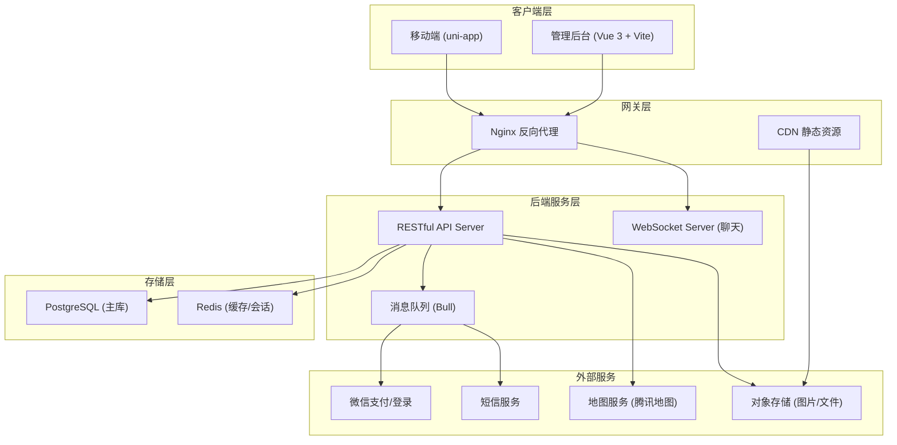
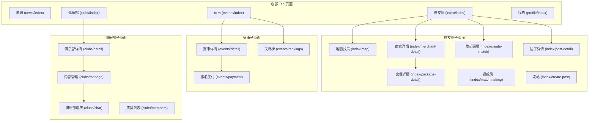
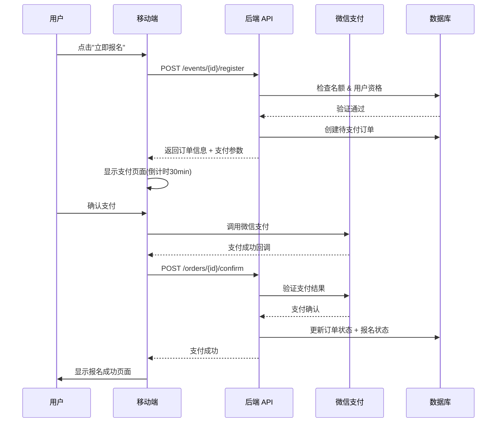
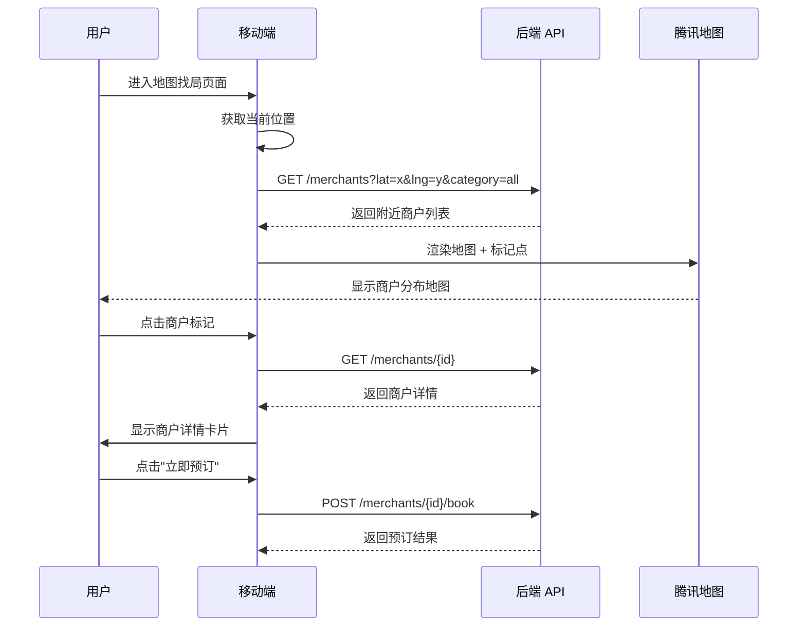
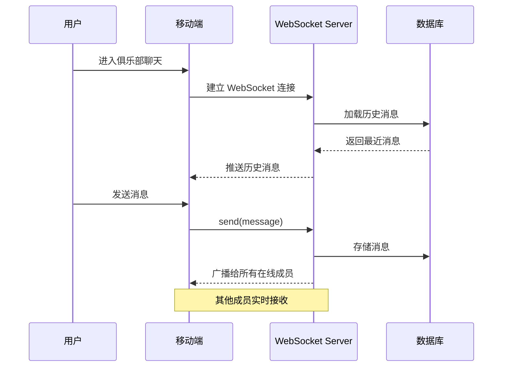

# Design Document: 掼蛋平台 UI 全面重构 (Guandan Platform UI Redesign)

## Overview

本设计文档覆盖掼蛋（Guandan）社交平台的完整 UI 重构，涵盖 13 个核心页面的前端重建、后端 API 集成以及管理后台同步更新。平台整合掼蛋牌局社交、餐饮商户发现、赛事管理和俱乐部功能，以深红色+金色为主视觉风格，采用卡片式布局和圆角设计。

技术栈保持现有架构：移动端使用 uni-app (Vue 3 + TypeScript + Sass)，管理后台使用 Vue 3 + Vite + Tailwind CSS。后端采用 RESTful API 设计，支持微信支付集成和地图服务。

本次重构的核心目标是：(1) 将产品设计稿精确还原为可交互页面；(2) 建立统一的设计系统（Design Token + 组件库）；(3) 完善后端 API 以支持所有前端功能；(4) 集成收入模型（报名费、商户佣金、广告费）。

## Architecture

### 系统整体架构



### 移动端页面架构



## Components and Interfaces

### 设计系统 (Design Tokens)

```typescript
// src/styles/tokens.ts - 设计令牌定义
export const DesignTokens = {
  colors: {
    primary: '#C41E3A',        // 深红色主色
    primaryDark: '#9B1830',    // 深红色暗色
    primaryLight: '#E8354F',   // 深红色浅色
    gold: '#D4A843',           // 金色强调色
    goldLight: '#F0D68A',      // 金色浅色
    background: '#F5F5F5',     // 页面背景
    surface: '#FFFFFF',        // 卡片/容器背景
    textPrimary: '#1A1A1A',   // 主文字
    textSecondary: '#666666',  // 次要文字
    textTertiary: '#999999',   // 辅助文字
    border: '#EEEEEE',        // 边框
    success: '#52C41A',        // 成功
    warning: '#FAAD14',        // 警告
    error: '#FF4D4F',          // 错误
  },
  spacing: {
    xs: '8rpx',
    sm: '16rpx',
    md: '24rpx',
    lg: '32rpx',
    xl: '48rpx',
  },
  radius: {
    sm: '8rpx',
    md: '16rpx',
    lg: '24rpx',
    xl: '32rpx',
    full: '9999rpx',
  },
  fontSize: {
    xs: '20rpx',
    sm: '24rpx',
    base: '28rpx',
    md: '32rpx',
    lg: '36rpx',
    xl: '40rpx',
    '2xl': '48rpx',
  },
  shadow: {
    sm: '0 2rpx 8rpx rgba(0,0,0,0.04)',
    md: '0 4rpx 16rpx rgba(0,0,0,0.08)',
    lg: '0 8rpx 32rpx rgba(0,0,0,0.12)',
  },
} as const
```

### 核心 UI 组件接口

```typescript
// src/components/ui/types.ts

/** 通用卡片组件 */
export interface CardProps {
  padding?: string
  radius?: 'sm' | 'md' | 'lg'
  shadow?: 'sm' | 'md' | 'lg'
  border?: boolean
}

/** 标签页组件 */
export interface TabItem {
  key: string
  label: string
  badge?: number
}

export interface TabBarProps {
  items: TabItem[]
  activeKey: string
  scrollable?: boolean
  lineStyle?: 'underline' | 'background'
}

/** 约局卡片组件 */
export interface MatchCardProps {
  id: number
  title: string
  hostAvatar: string
  hostName: string
  time: string
  location: string
  currentPlayers: number
  maxPlayers: number
  tags: string[]
  status: 'open' | 'full' | 'started' | 'ended'
}

/** 商户卡片组件 */
export interface MerchantCardProps {
  id: number
  name: string
  coverImage: string
  rating: number
  pricePerPerson?: number
  distance?: string
  tags: string[]
  address: string
}

/** 赛事卡片组件 */
export interface EventCardProps {
  id: number
  title: string
  coverImage?: string
  startTime: string
  location: string
  prizePool: number
  registrationFee: number
  currentParticipants: number
  maxParticipants: number
  status: EventStatus
}

/** 排行榜项目组件 */
export interface RankingItemProps {
  rank: number
  userId: number
  avatar: string
  nickname: string
  score: number
  tier: string
  isHighlighted?: boolean  // 前三名高亮
}

/** 俱乐部卡片组件 */
export interface ClubCardProps {
  id: number
  name: string
  logo: string
  memberCount: number
  location: string
  tags: string[]
  description: string
}

/** 资讯文章卡片 */
export interface ArticleCardProps {
  id: number
  title: string
  thumbnail?: string
  source: string
  publishTime: string
  viewCount: number
  likeCount: number
  category: string
}

/** 支付按钮组件 */
export interface PaymentButtonProps {
  amount: number
  label: string
  loading?: boolean
  disabled?: boolean
  countdown?: number  // 倒计时秒数
}
```

### 页面级组件接口

```typescript
// src/types/page.ts - 页面级数据接口

/** 掼友圈首页 */
export interface CircleHomeData {
  activeTab: 'latest' | 'friends' | 'map'
  hotMatches: MatchCardProps[]
  posts: Post[]
  isRefreshing: boolean
  hasMore: boolean
}

/** 地图找局页面 */
export interface MapPageData {
  activeCategory: 'all' | 'dining' | 'teahouse' | 'chess'
  merchants: Merchant[]
  mapCenter: { latitude: number; longitude: number }
  searchKeyword: string
  mapMarkers: MapMarker[]
}

export interface MapMarker {
  id: number
  latitude: number
  longitude: number
  title: string
  iconPath: string
  width: number
  height: number
  callout?: {
    content: string
    display: 'ALWAYS' | 'BYCLICK'
  }
}

/** 赛事列表页面 */
export interface EventListData {
  activeTab: 'all' | 'circle' | 'ongoing' | 'ended'
  events: GameEvent[]
  isRefreshing: boolean
  hasMore: boolean
}

/** 天梯榜页面 */
export interface RankingsPageData {
  activeTab: 'personal' | 'club'
  activeLevel: 'all' | 'beginner' | 'intermediate' | 'advanced'
  topThree: RankingItemProps[]
  rankings: RankingItemProps[]
  myRanking?: RankingItemProps
}

/** 赛事报名支付页面 */
export interface PaymentPageData {
  event: GameEvent
  quantity: number
  registrationFee: number
  deposit: number
  totalAmount: number
  countdown: number  // 秒
  paymentMethod: 'wechat' | 'balance'
  isSubmitting: boolean
}

/** 俱乐部详情页面 */
export interface ClubDetailData {
  club: Club
  activeTab: 'notice' | 'activities' | 'achievements' | 'stats'
  notices: ClubNotice[]
  activities: ClubActivity[]
  isMember: boolean
  isApplying: boolean
}

/** 个人中心页面 */
export interface ProfilePageData {
  user: User
  stats: {
    points: number
    matches: number
    wins: number
    honor: number
  }
  menuGrid: ProfileMenuItem[]
  menuList: ProfileMenuItem[]
}

export interface ProfileMenuItem {
  key: string
  label: string
  icon: string
  badge?: number
  path: string
}
```

## Data Models

### 扩展数据模型

```typescript
// src/types/merchant.ts - 扩展商户模型
export interface MerchantDetail extends Merchant {
  photos: string[]
  businessHours: string
  phone: string
  packages: DiningPackage[]
  // 商务约局相关
  businessMatchCapacity: number
  diningMatchCapacity: number
  // 评价
  reviewCount: number
  avgScore: number
}

export interface MerchantCategory {
  key: 'all' | 'dining' | 'teahouse' | 'chess'
  label: string
  icon: string
}

// src/types/event.ts - 扩展赛事模型
export interface EventDetail extends GameEvent {
  rules: string           // 比赛规则 (富文本)
  prizeSettings: PrizeSetting[]
  schedule: EventSchedule[]
  registrationDeadline: string
  deposit?: number
}

export interface PrizeSetting {
  rank: number
  label: string          // 冠军/亚军/季军
  amount: number
}

export interface EventSchedule {
  round: number
  startTime: string
  description: string
}

// src/types/news.ts - 资讯模型
export interface Article {
  id: number
  title: string
  content: string         // 富文本 HTML
  thumbnail?: string
  category: 'recommended' | 'news' | 'tutorial' | 'culture' | 'sports'
  source: string
  author?: string
  publishTime: string
  viewCount: number
  likeCount: number
  commentCount: number
  isLiked: boolean
  isBookmarked: boolean
}

export interface ArticleComment {
  id: number
  articleId: number
  userId: number
  userNickname: string
  userAvatar?: string
  content: string
  createdAt: string
}

// src/types/ranking.ts - 排行榜模型
export interface RankingEntry {
  rank: number
  userId: number
  nickname: string
  avatar?: string
  score: number
  tier: 'bronze' | 'silver' | 'gold' | 'platinum' | 'diamond'
  totalMatches: number
  winRate: number
}

export interface ClubRanking {
  rank: number
  clubId: number
  clubName: string
  clubLogo?: string
  totalScore: number
  memberCount: number
  eventCount: number
}

// src/types/club.ts - 扩展俱乐部模型
export interface ClubDetail extends Club {
  announcements: ClubNotice[]
  activities: ClubActivity[]
  achievements: ClubAchievement[]
  stats: ClubStats
}

export interface ClubNotice {
  id: number
  clubId: number
  title: string
  content: string
  createdAt: string
  isPinned: boolean
}

export interface ClubAchievement {
  id: number
  title: string
  description: string
  icon: string
  unlockedAt?: string
}

export interface ClubStats {
  totalMembers: number
  totalEvents: number
  totalMatches: number
  avgScore: number
}

export interface ClubChatMessage {
  id: number
  clubId: number
  userId: number
  userNickname: string
  userAvatar?: string
  content: string
  type: 'text' | 'image' | 'system'
  createdAt: string
}

// src/types/order.ts - 扩展订单模型
export interface PaymentOrder {
  id: number
  orderNo: string
  userId: number
  type: 'event_registration' | 'package_purchase' | 'deposit'
  amount: number
  status: 'pending' | 'paid' | 'refunded' | 'cancelled' | 'expired'
  paymentMethod: 'wechat' | 'balance'
  relatedId: number      // 关联的赛事/套餐 ID
  expiresAt: string      // 支付截止时间
  paidAt?: string
  createdAt: string
}
```

### 验证规则

| 模型 | 字段 | 验证规则 |
|------|------|----------|
| Event Registration | quantity | 1 ≤ quantity ≤ 剩余名额 |
| Event Registration | totalAmount | = (registrationFee × quantity) + deposit |
| Payment | countdown | 创建后 30 分钟内有效 |
| Merchant | rating | 0.0 ≤ rating ≤ 5.0 |
| Post | content | 1 ≤ length ≤ 2000 字符 |
| Post | images | 0 ≤ count ≤ 9 张 |
| Club | name | 2 ≤ length ≤ 20 字符 |
| Match | maxPlayers | 4 (固定四人局) |

## Sequence Diagrams

### 赛事报名支付流程



### 地图找局流程



### 俱乐部聊天流程



## Key Functions with Formal Specifications

### Function 1: createEventRegistration()

```typescript
async function createEventRegistration(
  eventId: number,
  userId: number,
  quantity: number
): Promise<PaymentOrder>
```

**Preconditions:**
- `eventId` 对应的赛事存在且 status === 'registration'
- `userId` 对应的用户存在且 status === 'active'
- `quantity >= 1 && quantity <= event.maxParticipants - event.currentParticipants`
- 用户未重复报名同一赛事
- 当前时间 < event.registrationDeadline

**Postconditions:**
- 创建状态为 'pending' 的 PaymentOrder
- `order.amount === event.registrationFee * quantity + (event.deposit ?? 0)`
- `order.expiresAt === now() + 30 minutes`
- event.currentParticipants 不变（待支付成功后更新）

**Loop Invariants:** N/A

### Function 2: processPaymentCallback()

```typescript
async function processPaymentCallback(
  orderNo: string,
  transactionId: string,
  payResult: 'success' | 'fail'
): Promise<void>
```

**Preconditions:**
- `orderNo` 对应的订单存在且 status === 'pending'
- `transactionId` 来自微信支付回调且验签通过
- 订单未过期 (now() < order.expiresAt)

**Postconditions:**
- 若 payResult === 'success':
  - order.status 更新为 'paid'
  - order.paidAt 设为当前时间
  - 对应赛事 currentParticipants += order.quantity
  - 创建 EventRegistration 记录
- 若 payResult === 'fail':
  - order.status 保持 'pending'（用户可重试）
- 不会产生重复处理（幂等性）

**Loop Invariants:** N/A

### Function 3: getNearbyMerchants()

```typescript
async function getNearbyMerchants(
  latitude: number,
  longitude: number,
  category: MerchantCategory['key'],
  radius: number,       // 米
  page: number,
  pageSize: number
): Promise<{ merchants: Merchant[]; total: number }>
```

**Preconditions:**
- `-90 <= latitude <= 90 && -180 <= longitude <= 180`
- `radius > 0 && radius <= 50000` (最大50km)
- `page >= 1 && pageSize >= 1 && pageSize <= 50`
- `category` 为合法枚举值

**Postconditions:**
- 返回的所有商户 distance <= radius
- 商户按距离升序排列
- 若 category !== 'all'，返回商户均属于该分类
- `merchants.length <= pageSize`
- 所有商户 status === 'active'

**Loop Invariants:**
- 对于返回列表中的任意两个相邻商户 merchants[i] 和 merchants[i+1]:
  `merchants[i].distance <= merchants[i+1].distance`

### Function 4: calculateRankings()

```typescript
async function calculateRankings(
  type: 'personal' | 'club',
  level: 'all' | 'beginner' | 'intermediate' | 'advanced',
  page: number,
  pageSize: number
): Promise<{ rankings: RankingEntry[]; total: number }>
```

**Preconditions:**
- `type` 为 'personal' 或 'club'
- `page >= 1 && pageSize >= 1 && pageSize <= 100`

**Postconditions:**
- 返回的排名严格递减（score 降序）
- `rankings[i].rank === (page - 1) * pageSize + i + 1`
- 若 level !== 'all'，所有条目的 tier 对应 level 范围
- 同分用户按最近比赛时间排序

**Loop Invariants:**
- `∀i ∈ [0, rankings.length-1): rankings[i].score >= rankings[i+1].score`

## Algorithmic Pseudocode

### 赛事报名名额锁定算法

```typescript
/**
 * 使用 Redis 分布式锁确保并发报名时名额正确
 * 防止超卖
 */
async function lockAndRegister(
  eventId: number,
  userId: number,
  quantity: number
): Promise<PaymentOrder> {
  const lockKey = `event:register:${eventId}`
  const lock = await redis.acquireLock(lockKey, { ttl: 5000 })
  
  if (!lock) {
    throw new Error('系统繁忙，请稍后重试')
  }

  try {
    // ASSERT: 持有分布式锁
    const event = await db.events.findById(eventId)
    
    // 验证名额
    const remainingSlots = event.maxParticipants - event.currentParticipants
    if (quantity > remainingSlots) {
      throw new Error('剩余名额不足')
    }

    // 验证重复报名
    const existing = await db.registrations.findByUserAndEvent(userId, eventId)
    if (existing && existing.status !== 'cancelled') {
      throw new Error('已报名该赛事')
    }

    // 创建订单（预扣名额在支付成功后确认）
    const order = await db.orders.create({
      userId,
      type: 'event_registration',
      amount: event.registrationFee * quantity + (event.deposit ?? 0),
      relatedId: eventId,
      status: 'pending',
      expiresAt: new Date(Date.now() + 30 * 60 * 1000),
    })

    // ASSERT: order.status === 'pending' && order.expiresAt > now()
    return order
  } finally {
    await redis.releaseLock(lock)
  }
}
```

### ELO 积分更新算法

```typescript
/**
 * 掼蛋 ELO 积分计算
 * 基于标准 ELO 算法，针对四人制牌局做调整
 * 
 * Preconditions:
 *   - players.length === 4 (固定四人局)
 *   - rankings 为 1-4 名次排列
 * Postconditions:
 *   - 所有玩家积分变化之和 === 0 (零和博弈)
 *   - 胜者积分增加，败者积分减少
 */
function calculateEloUpdates(
  players: Array<{ userId: number; score: number; kFactor: number }>,
  rankings: number[]  // index -> 名次 (1=冠军, 4=末位)
): Array<{ userId: number; scoreDelta: number; newScore: number }> {
  const results: Array<{ userId: number; scoreDelta: number; newScore: number }> = []
  
  for (let i = 0; i < players.length; i++) {
    let totalDelta = 0
    
    // 与每个对手计算期望胜率和实际结果
    for (let j = 0; j < players.length; j++) {
      if (i === j) continue
      
      // 期望胜率
      const expectedWin = 1 / (1 + Math.pow(10, (players[j].score - players[i].score) / 400))
      
      // 实际结果: 赢=1, 输=0, 名次更高则赢
      const actualResult = rankings[i] < rankings[j] ? 1 : 0
      
      // 积分变化
      totalDelta += players[i].kFactor * (actualResult - expectedWin)
    }
    
    // 四人局中需要除以对手数(3)进行归一化
    const normalizedDelta = Math.round(totalDelta / 3)
    
    results.push({
      userId: players[i].userId,
      scoreDelta: normalizedDelta,
      newScore: players[i].score + normalizedDelta,
    })
  }
  
  // ASSERT: results.reduce((sum, r) => sum + r.scoreDelta, 0) ≈ 0
  return results
}
```

### 商户距离排序与分页算法

```typescript
/**
 * 基于 PostGIS 的地理位置查询
 * 使用空间索引实现高效范围查询
 * 
 * Preconditions:
 *   - coordinates 在有效范围内
 *   - radius <= 50000 (50km)
 * Postconditions:
 *   - 结果按距离升序排列
 *   - 所有结果在指定半径内
 */
async function queryNearbyMerchants(
  lat: number,
  lng: number,
  radiusMeters: number,
  category: string,
  page: number,
  pageSize: number
): Promise<{ merchants: MerchantWithDistance[]; total: number }> {
  // 使用 PostGIS ST_DWithin + ST_Distance 进行空间查询
  const query = `
    SELECT *,
      ST_Distance(
        location::geography,
        ST_SetSRID(ST_MakePoint($1, $2), 4326)::geography
      ) as distance
    FROM merchants
    WHERE status = 'active'
      AND ST_DWithin(
        location::geography,
        ST_SetSRID(ST_MakePoint($1, $2), 4326)::geography,
        $3
      )
      ${category !== 'all' ? 'AND category = $6' : ''}
    ORDER BY distance ASC
    LIMIT $4 OFFSET $5
  `
  
  const offset = (page - 1) * pageSize
  const params = [lng, lat, radiusMeters, pageSize, offset]
  if (category !== 'all') params.push(category)
  
  const results = await db.query(query, params)
  const total = await db.queryCount(/* count query */)
  
  // ASSERT: ∀ r ∈ results: r.distance <= radiusMeters
  // ASSERT: results 按 distance 升序
  return { merchants: results, total }
}
```

## Example Usage

### 掼友圈首页组合逻辑

```typescript
// pages/index/index.vue - Composition API
import { ref, onMounted, computed } from 'vue'
import { getHotMatches } from '@/api/matchmaking'
import { getPosts } from '@/api/posts'
import type { CircleHomeData } from '@/types/page'

export function useCircleHome() {
  const activeTab = ref<CircleHomeData['activeTab']>('latest')
  const hotMatches = ref<MatchCardProps[]>([])
  const posts = ref<Post[]>([])
  const page = ref(1)
  const hasMore = ref(true)
  const isRefreshing = ref(false)

  const loadData = async (refresh = false) => {
    if (refresh) {
      page.value = 1
      hasMore.value = true
    }
    
    try {
      const [matchRes, postRes] = await Promise.all([
        getHotMatches({ limit: 5 }),
        getPosts({ tab: activeTab.value, page: page.value, pageSize: 10 }),
      ])
      
      hotMatches.value = matchRes.data
      posts.value = refresh 
        ? postRes.data.list 
        : [...posts.value, ...postRes.data.list]
      hasMore.value = postRes.data.hasMore
    } finally {
      isRefreshing.value = false
    }
  }

  const onRefresh = () => {
    isRefreshing.value = true
    loadData(true)
  }

  const onLoadMore = () => {
    if (!hasMore.value) return
    page.value++
    loadData()
  }

  onMounted(() => loadData(true))

  return { activeTab, hotMatches, posts, hasMore, isRefreshing, onRefresh, onLoadMore }
}
```

### 赛事报名支付页面

```typescript
// pages/events/payment.vue - 支付逻辑
import { ref, computed, onMounted, onUnmounted } from 'vue'
import { createRegistration, confirmPayment } from '@/api/events'
import { usePayment } from '@/composables/usePayment'

export function useEventPayment(eventId: number) {
  const quantity = ref(1)
  const event = ref<EventDetail | null>(null)
  const order = ref<PaymentOrder | null>(null)
  const countdown = ref(0)
  const isSubmitting = ref(false)
  let timer: number | null = null

  const totalAmount = computed(() => {
    if (!event.value) return 0
    return event.value.registrationFee * quantity.value + (event.value.deposit ?? 0)
  })

  // 倒计时逻辑
  const startCountdown = (expiresAt: string) => {
    const updateCountdown = () => {
      const remaining = Math.max(0, new Date(expiresAt).getTime() - Date.now())
      countdown.value = Math.floor(remaining / 1000)
      if (countdown.value <= 0 && timer) {
        clearInterval(timer)
        uni.showToast({ title: '订单已过期', icon: 'none' })
      }
    }
    updateCountdown()
    timer = setInterval(updateCountdown, 1000) as unknown as number
  }

  const submitPayment = async () => {
    if (isSubmitting.value || !order.value) return
    isSubmitting.value = true
    
    try {
      const { requestPayment } = usePayment()
      await requestPayment({
        orderNo: order.value.orderNo,
        amount: totalAmount.value,
      })
      
      // 支付成功跳转
      uni.redirectTo({ url: '/pages/common/payment-result?status=success' })
    } catch (err) {
      uni.showToast({ title: '支付失败，请重试', icon: 'none' })
    } finally {
      isSubmitting.value = false
    }
  }

  onMounted(async () => {
    // 创建订单
    const res = await createRegistration(eventId, quantity.value)
    order.value = res.data
    startCountdown(res.data.expiresAt)
  })

  onUnmounted(() => {
    if (timer) clearInterval(timer)
  })

  return { event, quantity, totalAmount, countdown, isSubmitting, submitPayment }
}
```

### 天梯榜前三名展示

```typescript
// pages/events/rankings.vue - 排行榜逻辑
import { ref, watch } from 'vue'
import { getRankings } from '@/api/rankings'

export function useRankings() {
  const activeTab = ref<'personal' | 'club'>('personal')
  const activeLevel = ref<'all' | 'beginner' | 'intermediate' | 'advanced'>('all')
  const topThree = ref<RankingEntry[]>([])
  const rankings = ref<RankingEntry[]>([])

  const loadRankings = async () => {
    const res = await getRankings({
      type: activeTab.value,
      level: activeLevel.value,
      page: 1,
      pageSize: 50,
    })
    
    // 前三名单独展示
    topThree.value = res.data.list.slice(0, 3)
    rankings.value = res.data.list.slice(3)
  }

  watch([activeTab, activeLevel], loadRankings, { immediate: true })

  return { activeTab, activeLevel, topThree, rankings }
}
```

## Correctness Properties

*A property is a characteristic or behavior that should hold true across all valid executions of a system—essentially, a formal statement about what the system should do. Properties serve as the bridge between human-readable specifications and machine-verifiable correctness guarantees.*

### Property 1: 赛事报名名额一致性

*For any* event, the currentParticipants count SHALL equal the number of registrations with status 'registered' or 'checked_in' for that event.

**Validates: Requirements 6.5, 9.4**

### Property 2: 支付金额正确性

*For any* event registration order with valid registrationFee, quantity, and deposit, the order amount SHALL equal (registrationFee × quantity) + deposit.

**Validates: Requirements 6.2**

### Property 3: 排行榜有序性

*For any* rankings result list, all entries SHALL be ordered by score descending, with ties broken by most recent match time.

**Validates: Requirements 7.4, 7.5**

### Property 4: 地理查询范围与排序约束

*For any* nearby merchant query result, all returned merchants SHALL be within the specified radius from the query center AND ordered by distance ascending.

**Validates: Requirements 3.4**

### Property 5: ELO 零和性

*For any* completed four-player match, the sum of all players' score deltas SHALL be zero (within rounding tolerance of ±4).

**Validates: Requirements 8.2**

### Property 6: 订单过期不可支付

*For any* payment order where the current time exceeds expiresAt, the system SHALL reject payment attempts and the order SHALL NOT transition to 'paid' status.

**Validates: Requirements 6.9**

### Property 7: 俱乐部成员数一致性

*For any* club, the memberCount field SHALL equal the count of active member records associated with that club.

**Validates: Requirement 9.4**

### Property 8: 帖子内容与图片验证

*For any* post creation request, content length outside [1, 2000] characters SHALL be rejected, and image count exceeding 9 SHALL be rejected.

**Validates: Requirements 2.4, 2.5, 2.6**

### Property 9: 商户评分范围

*For any* merchant, the rating value SHALL be within [0.0, 5.0]. Ratings outside this range SHALL be rejected by validation.

**Validates: Requirement 3.7**

### Property 10: 分类筛选一致性

*For any* filtered data list (merchants by category, events by status tab, rankings by level, articles by category), all items in the result SHALL match the selected filter criteria.

**Validates: Requirements 3.5, 5.2, 7.2, 7.6, 11.2**

### Property 11: ELO 单调性

*For any* player, beating a higher-rated opponent SHALL award more points than beating a lower-rated opponent, given the same player rating and K-factor.

**Validates: Requirement 8.5**

### Property 12: 重复报名拒绝

*For any* user who already has an active registration for an event, subsequent registration attempts for the same event SHALL be rejected.

**Validates: Requirement 6.7**

### Property 13: 约局满员状态转换

*For any* match where currentPlayers equals maxPlayers (4), the match status SHALL be 'full' and additional join requests SHALL be rejected.

**Validates: Requirement 4.4**

### Property 14: 支付回调幂等性

*For any* payment callback processed multiple times with the same transaction ID, the system SHALL produce the same final state as processing it once (no duplicate participant count increments or duplicate order status changes).

**Validates: Requirements 6.10, 15.7**

### Property 15: 手机号脱敏

*For any* valid phone number displayed to users, the system SHALL mask middle digits (showing only first 3 and last 4 digits).

**Validates: Requirement 15.6**

### Property 16: XSS 内容过滤

*For any* rich-text input containing script tags, event handlers, or other XSS vectors, the content filter SHALL remove or escape all dangerous elements while preserving safe content.

**Validates: Requirement 15.5**

### Property 17: WebSocket 重连退避

*For any* reconnection attempt number n, the retry delay SHALL equal min(2^(n-1) × 1000ms, 30000ms), following exponential backoff with a 30-second cap.

**Validates: Requirement 10.3**

### Property 18: 俱乐部名称验证

*For any* club creation request, the club name length SHALL be between 2 and 20 characters. Names outside this range SHALL be rejected.

**Validates: Requirements 9.1, 9.2**

### Property 19: RBAC 权限隔离

*For any* API endpoint and user role combination, the system SHALL grant access only if the role has explicit permission for that endpoint. Unauthorized access attempts SHALL return a 403 response.

**Validates: Requirements 13.5, 15.2**

## Error Handling

### Error Scenario 1: 支付超时

**Condition**: 用户在 30 分钟内未完成支付
**Response**: 
- 前端倒计时归零，禁用支付按钮，显示"订单已过期"
- 后端定时任务扫描过期订单，状态置为 'expired'
**Recovery**: 用户可重新点击报名创建新订单

### Error Scenario 2: 并发超卖

**Condition**: 多个用户同时报名导致名额超出
**Response**:
- 使用 Redis 分布式锁保护报名流程
- 数据库层使用乐观锁 (version 字段) 防止并发更新
**Recovery**: 被锁阻塞的请求收到"系统繁忙"提示，用户重试

### Error Scenario 3: 地图定位失败

**Condition**: 用户拒绝位置权限或 GPS 信号弱
**Response**:
- 显示默认城市中心位置
- 提示"定位失败，显示默认位置"
- 提供手动搜索入口
**Recovery**: 用户可通过搜索框手动输入位置

### Error Scenario 4: WebSocket 断连

**Condition**: 网络波动导致聊天连接中断
**Response**:
- 自动重连机制 (指数退避: 1s, 2s, 4s, 8s, max 30s)
- 重连成功后拉取断连期间的历史消息
- 界面显示"连接中..."状态
**Recovery**: 重连成功后无缝恢复聊天

### Error Scenario 5: 图片上传失败

**Condition**: 网络中断或文件过大
**Response**:
- 前端限制图片大小 (≤ 5MB)，超出自动压缩
- 上传失败显示重试按钮
- 支持断点续传
**Recovery**: 用户点击重试或重新选择图片

## Testing Strategy

### Unit Testing Approach

- 使用 Vitest 对 composables 和 utils 进行单元测试
- 测试覆盖率目标: 核心业务逻辑 > 80%
- 关键测试用例:
  - ELO 积分计算正确性
  - 支付金额计算
  - 倒计时逻辑
  - 分页加载逻辑
  - 数据格式化工具函数

### Property-Based Testing Approach

**Property Test Library**: fast-check

```typescript
// 示例: ELO 零和性验证
import * as fc from 'fast-check'

fc.assert(
  fc.property(
    fc.array(fc.record({ score: fc.integer(800, 2400), kFactor: fc.integer(10, 40) }), { minLength: 4, maxLength: 4 }),
    fc.shuffledSubarray([1, 2, 3, 4], { minLength: 4, maxLength: 4 }),
    (players, rankings) => {
      const results = calculateEloUpdates(
        players.map((p, i) => ({ userId: i, ...p })),
        rankings
      )
      const totalDelta = results.reduce((sum, r) => sum + r.scoreDelta, 0)
      return Math.abs(totalDelta) <= players.length // 允许四舍五入误差
    }
  )
)
```

### Integration Testing Approach

- 使用 Supertest + PostgreSQL 测试容器进行 API 集成测试
- 测试场景:
  - 完整报名支付流程
  - 并发报名场景
  - 微信支付回调处理
  - 地图商户查询

### E2E Testing

- uni-app 端使用 @dcloudio/uni-automator 进行自动化测试
- 覆盖核心用户流程:
  - 浏览掼友圈 → 查看约局 → 加入
  - 浏览赛事 → 报名 → 支付
  - 商户地图 → 详情 → 预订

## Performance Considerations

### 前端性能

- **图片懒加载**: 列表页图片使用 `lazy-load` 属性，视口外图片不加载
- **虚拟列表**: 长列表（排行榜、帖子流）使用虚拟滚动，仅渲染可见区域
- **分包加载**: uni-app 使用 subPackages 将非 Tab 页面分包，减少首包体积
- **骨架屏**: 页面加载时显示骨架屏，提升感知性能
- **缓存策略**: 使用 Pinia + localStorage 缓存用户数据和配置

### 后端性能

- **数据库索引**: 商户表建立空间索引 (GIST)，赛事表建立 status + start_time 复合索引
- **Redis 缓存**: 排行榜数据每 5 分钟刷新一次缓存，热门帖子缓存 1 分钟
- **分页查询**: 所有列表接口支持 cursor-based 分页，避免深分页性能问题
- **连接池**: 数据库连接池大小根据并发量动态调整

### 关键指标

| 指标 | 目标 |
|------|------|
| 首屏加载时间 (FCP) | < 1.5s |
| 列表滚动帧率 | ≥ 55fps |
| API 响应时间 (P95) | < 200ms |
| 地图标记渲染 | < 500ms (100个标记) |
| 支付流程总时长 | < 5s |

## Security Considerations

### 认证与授权

- JWT Token 认证，access_token 有效期 2 小时，refresh_token 7 天
- 接口级 RBAC 权限控制 (user/merchant/organizer/admin)
- 支付相关接口二次验证 (短信验证码/支付密码)

### 数据安全

- 敏感数据加密存储 (手机号脱敏显示)
- HTTPS 全链路加密
- 微信支付回调签名验证
- SQL 注入防护 (参数化查询)
- XSS 防护 (富文本内容过滤)

### 业务安全

- 报名防刷: 同一用户同一赛事仅可报名一次
- 支付防重放: 订单号唯一约束 + 幂等性处理
- 评论/帖子敏感词过滤
- 用户信誉分机制 (恶意行为扣分)

## Dependencies

### 移动端 (uni-app)

| 依赖 | 用途 |
|------|------|
| @dcloudio/uni-app | uni-app 框架核心 |
| vue@3.4 | 前端框架 |
| pinia@2.1 | 状态管理 |
| sass@1.70 | CSS 预处理 |
| @vueuse/core | 组合式工具集 (可选) |

### 管理后台

| 依赖 | 用途 |
|------|------|
| vue@3.4 | 前端框架 |
| vue-router@4.3 | 路由 |
| pinia@2.1 | 状态管理 |
| tailwindcss@3.4 | 原子化 CSS |
| axios@1.6 | HTTP 请求 |
| echarts@5 | 数据可视化图表 |

### 后端

| 依赖 | 用途 |
|------|------|
| express / koa | HTTP 框架 |
| prisma / typeorm | ORM |
| postgresql | 主数据库 |
| redis / ioredis | 缓存与分布式锁 |
| bull | 任务队列 |
| socket.io | WebSocket (聊天) |
| wechatpay-node-v3 | 微信支付 SDK |
| cos-nodejs-sdk-v5 | 对象存储 |

### 外部服务

| 服务 | 用途 |
|------|------|
| 腾讯地图 API | 地图展示与地理编码 |
| 微信开放平台 | 小程序登录 + 支付 |
| 腾讯云 COS | 图片/文件存储 |
| 短信服务 | 验证码发送 |
